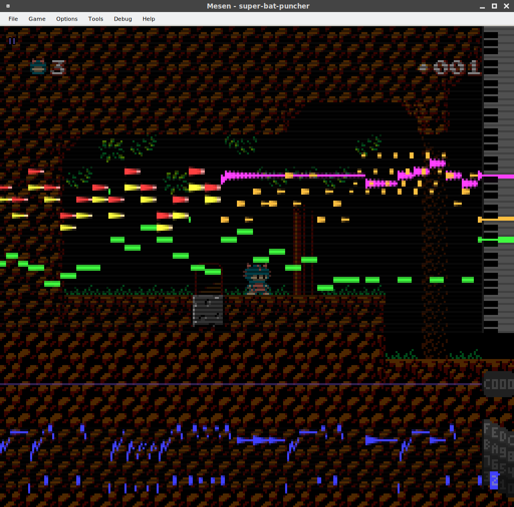

#Mesen Piano Roll

This script is a port of the piano roll feature from [RusticNes](https://github.com/zeta0134/rusticnes-sdl), implemented as a Lua script for the awesome [Mesen](https://github.com/SourMesen/Mesen) NES emulator. 

To use it, open up the Script Window (under Debug), then open piano_roll.lua and click Play. Clicking anywhere in the main window will cycle the background through various levels of transparent.

I haven't picked a proper license yet, but it'll be something FOSS friendly. Feel free to use this however you like. Shoutouts are appreciated but not required.
